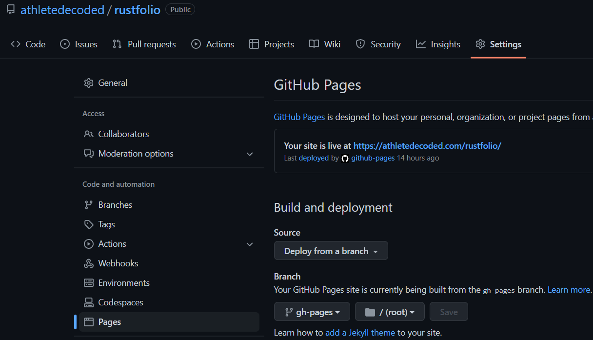

# Rustfolio 🦀

Check it out live @ [https://athletedecoded.com/rustfolio](https://athletedecoded.com/rustfolio)

Rust x MLOps Repo @ [https://github.com/athletedecoded/rust-mlops](https://github.com/athletedecoded/rust-mlops)


### To use this mdbook template

**Fork/clone from Github Repo**

[https://github.com/athletedecoded/rustfolio](https://github.com/athletedecoded/rustfolio)

**Install mdbook**
```
$ make install
```

**Sync Project README**

* Copy the [project template](./src/template.md) to create new project `./src/my-project.md`
* Add project link to `./src/SUMMARY.md` 
* In `my-project.md` uncomment `**Project Repo:**` and update to project repo url

To sync `my-project.md` with README content in the project repo run:

```
$ make sync
```

This will also fetch referenced `./assets/` images and download to local Rustfolio `./src/assets/` folder


**Preview mdbook**
```
$ make serve
```

**Deploy to Github Pages**

Automatic CI/CD via Github Actions on git push. See [.github/workflows/deploy.yml](.github/workflows/deploy.yml)

Note: this will automatically sync project README using `make sync`

```
$ git push origin main
```

**Configure Repo for Github Pages**

Ensure repository is serving from `gh-pages` branch



## References

* [mdBook Official Docs](https://rust-lang.github.io/mdBook/)
* [mdBook Automated Deployment with Github Actions](https://github.com/rust-lang/mdBook/wiki/Automated-Deployment%3A-GitHub-Actions)
* [peaceiris Github Actions for mdBook](https://github.com/marketplace/actions/github-pages-action#%EF%B8%8F-mdbook-rust)

<hr>

### Credits: [athletedecoded](https://github.com/athletedecoded)