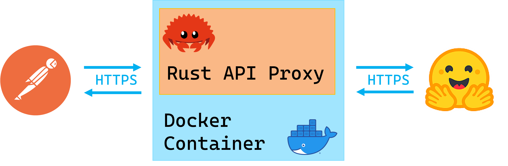

**Project Repo:** [https://github.com/athletedecoded/hf-micro](https://github.com/athletedecoded/hf-micro)


# IDS721 Spring 2023 Project 2 - Rust Containerized Microservice

The [HuggingFace Hub](https://github.com/huggingface/huggingface_hub) is implemented as a Python wrapper around the HuggingFace API Endpoints. This project is a dockerized Rust microservice that acts as an API proxy for the HuggingFace API Endpoints. 



## What I Learnt

* Configuring reqwest for GET, POST, PUT, DELETE requests
* Certifying HTTPS using reqwest from within a Docker image -- I spent days debugging and exhausting certification solutions and it all came down to enabling the rustls-tls feature in reqwest and either installing debian ca-certificates or mounting them to Docker at runtime 🤯


## Setup

**Install**
```
$ make install
```

**HuggingFace Access Token**
1. Generate a [HuggingFace personal access token](https://huggingface.co/docs/hub/security-tokens) with write permissions
2. Configure environment variables below per choice of launching locally or within Docker


**To launch locally**
1. Rename `SAMPLE_ENV` to `.env` and save
2. Set your HF personal access token in `.env`
3. Run local microservice on localhost:8080

```
$ make run
```

**To launch within Docker**
1. Set your HF personal access token in [Makefile (line 2)](./hf-micro/Makefile)
2. Build Docker image

```
$ make build
```

3. Run Docker image

```
$ make rundocker
```

**Docker Debugging CA-Certificates**

If you have CA-certification issues you may need to manually mount self-signed certificates to the Docker image instead. To do this first generate .pem certificate
```
# make local certs dir
$ mkdir ./certs
# generate ca-certificates
$ openssl req -x509 -newkey rsa:4096 -keyout ./certs/key.pem -out ./certs/cert.pem -sha256 -days 365 -nodes -subj '/CN=localhost'
```

Then launch Docker image with mounted certificates

```
$ make mntcerts
```

## Useage & Endpoints

Supported endpoints to base URL https://localhost:8080

**GET /** -- Homepage

**GET /api/account** -- Returns your HuggingFace account info

**POST /api/repo** -- Create a new repository

    ```
    POST /api/repo json request body 
    {
        "type": <"model","dataset" or "spaces">
        "name": <repo_name>,
        "private": <true or false>
    }
    ```

**DELETE /api/repo** -- Delete a repository

    ```
    DELETE /api/repo json request body 
    {
        "type": <"model","dataset" or "spaces">
        "name": <repo_name>
    }
    ```

**PUT /api/repo** -- Update repository visibility

    ```
    PUT /api/repo json request body 
    {
        "type": <"model","dataset" or "spaces">
        "namespace": "<username>/<repo_name>" eg. "ferris/my_repo"
        "private": <true or false>
    }
    ```

## ToDos

- [x] Configure GET, POST, DELETE, PUSH routes
- [x] Pass environment variables into Docker per [docs](https://docs.docker.com/compose/environment-variables/set-environment-variables/#set-environment-variables-with-docker-compose-run---env)
- [x] Debug reqwest x Rust x Docker CA Certificate bug
- [x] Configure Actix logging
- [x] Actix HTTP error response handling
- [x] CI/CD & Binary Release


## References

* [HuggingFace Hub Python Client](https://github.com/huggingface/huggingface_hub)
* [HF access tokens](https://huggingface.co/docs/hub/security-tokens)
* [HF Hub REST API Endpoints](https://huggingface.co/docs/hub/api)
* [Actix extractors](https://actix.rs/docs/extractors/)
* [reqwest crate docs](https://crates.io/crates/reqwest)
* [TLS Debugging Docker](https://smallstep.com/blog/automate-docker-ssl-tls-certificates/)
