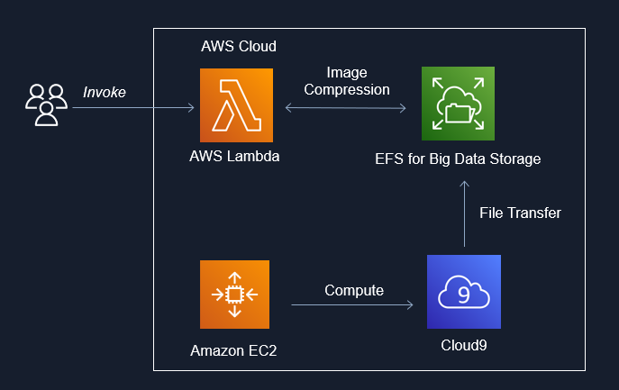

**Project Repo:** [https://github.com/athletedecoded/img-compress](https://github.com/athletedecoded/img-compress)


# IDS721 Spring 2023 Project 4 - Image Compression for Big Data

Image Compression for Big Data using EFS x Lambda x Rust. Uses downsampling + filter to perform inplace image compression in parallel and reduce the memory cost of big image data storage. Includes upsampling invocation option to restore image size.



## Useage

```
cargo lambda invoke --remote \
    --data-ascii '{"dir": "imgs", "scale_op": "down", "scale_factor": 2, "filter": "Gaussian"}' \
    --output-format json \
    img-comp
```

where:

* dir = subdirectory to perform compression on i.e. /mnt/efs/{dir}
* scale_op = "down","up"
* scale_factor = factor to scale width/height
* filter = "gaussian" (default), "nearest", "triangle", "catmullrom", "lanczos3"

## Developer Setup

**Configure AWS IAM Permissions**

1. Create an IAM User policy for "LambdaDev" with `AWSLambda_FullAccess` permissions and added custom inline permission config
```
{
    "Version": "2012-10-17",
    "Statement": [
        {
            "Sid": "PermissionsToDeploy",
            "Effect": "Allow",
            "Action": [
                "iam:CreateRole",
                "iam:CreatePolicy",
                "iam:PutRolePolicy",
                "iam:AttachRolePolicy",
                "iam:UpdateAssumeRolePolicy"
            ],
            "Resource": "*"
        }
    ]
}
```
2. Add "LambdaDev" access keys to your local ~/.aws/credentials file along with environment variables: 
* aws_access_key_id
* aws_secret_access_key
* aws_role_arn (NB: this is copied from the IAM user summary and is formatted as arn:aws:iam::<aws_acct>:user/<iam_user>)
* region 

3. Create an IAM Role policy named "EFSxLambda" with `AWSLambdaBasicExecutionRole` + `AWSLambdaVPCAccessExecutionRole` + `AmazonElasticFileSystemClientFullAccess` permissions

**Deploy Lambda Fxn from Developer Environment (i.e. this repo)**

```
# Install cargo-lambda
$ python3 -m venv ~/.venv
$ source ~/.venv/bin/activate
$ make install

# Build Binary 
$ make release

# Deploy to AWS
$ make deploy
```

**Setup Cloud9**

1. Launch Cloud9 console and create an environment with "New EC2 Instance" + "SSM Connection" + "default VPC"
2. Once provisioned, click on env details > EC2 instance > manage EC2 instance. Make note of the associated security group listed.

**Setup EFS**

1. Launch AWS EFS console and provision EFS instance
2. Once provisioned, click on file system name > network. Make note of the security group id listed. 
3. Under EFS access points tab > add access point > create with following settings:
  * Name: Lambda2EFS
  * Root directory path: `/` (by default root is /mnt/efs)
  * Posix User ID: 1000
  * Posix Group ID: 1000
  * Owner User ID: 1000
  * Owner Group ID: 1000
  * Access point permissions: 0777

**Configure Security Groups**

1. From EC2 console > security groups > new security group: 
  * Name = ImgComp
  * Description = Mangage img-comp lambda access
  * VPC = same as EFS (default)
  * Save
2. To enable EFS --> Lambda: click ImgComp security group ID > edit inbound rules > Set: type = NFS, protocol = TCP, port range = 2049, source = custom > add the EFS security group ID (from the drop down box)
3. To enable EFS --> Cloud9: click Cloud9 security group ID > edit inbound rules > Set: type = NFS, protocol = TCP, port range = 2049, source = custom > add the EFS security group ID (from the drop down box).
4. To enable Lambda & Cloud 9 --> EFS: click EFS security group ID > edit inbound rules > add inbound rule for each:
  * Set: type = NFS, protocol = TCP, port range = 2049, source = custom > add the ImgComp security group ID (from the drop down box)
  * Set: type = NFS, protocol = TCP, port range = 2049, source = custom > add the Cloud9 security group ID (from the drop down box)

**Configure Lambda**

1. Configuration > Permissions > edit execution role > select "EFSxLambda" from above
2. Configuration > VPC > edit > select default VPC (to match EFS)
3. Configuration > VPC > edit > select security group as ImgComp
4. Configuration > File Systems > add EFS + access point + local mount path = /mnt/efs
5. Configuration > Env Variables > LD_LIBRARY_PATH = /mnt/efs

**Mount EFS to Cloud9**

1. Launch Cloud9 environment
2. Run the following commands to mount to /mnt/efs

```
# Docs: https://repost.aws/knowledge-center/efs-mount-automount-unmount-steps

# Install efs-ultils (https://docs.aws.amazon.com/efs/latest/ug/installing-amazon-efs-utils.html)
sudo yum install -y amazon-efs-utils

sudo mkdir -p /mnt/efs

# From img-comp EFS > Attach > copy EFS helper command
sudo mount -t efs -o tls <AWS_FS_ID>:/ /mnt/efs

# Switch ownership permissions
sudo chown ec2-user:ec2-user /mnt/efs
sudo chmod 755 /mnt/efs

# Copy local Cloud9 imgs directory to EFS
cp -r imgs /mnt/efs

# check files have been moved over
cd /mnt/efs
ls
```

## Gotchas
* Invokation failure may be insufficient lambda CPU/tmp storage that needs to be reconfigured for higher capacity


## References
* [AWS EFS + Lambda Guide](https://aws.amazon.com/blogs/compute/using-amazon-efs-for-aws-lambda-in-your-serverless-applications/)
* [Mount EC2 to EFS](https://docs.aws.amazon.com/efs/latest/ug/mounting-fs-mount-helper-ec2-linux.html)
* [Noah's Repo](https://github.com/noahgift/rust-mlops-template/tree/main/onnx-efs-lambda)
