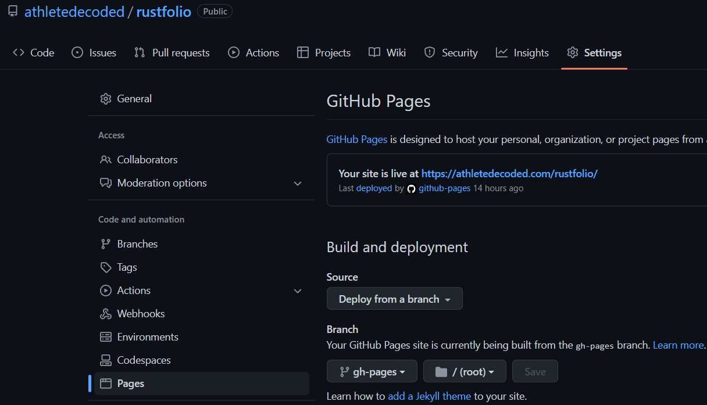

# Rustfolio 🦀

Github [@athletedecoded](https://github.com/athletedecoded)

Learning by building Rust for MLOps projects at Duke Univeristy with [Noah Gift](https://github.com/noahgift).

### To use this mdbook template

**Fork/clone from Github Repo**

[https://github.com/athletedecoded/rustfolio](https://github.com/athletedecoded/rustfolio)

**Install mdbook**
```
$ make install
```

**Preview mdbook**
```
$ make serve
```

**Deploy to Github Pages**

Automatic CI/CD via Github Actions on git push. See [.github/workflows/deploy.yml](.github/workflows/deploy.yml)

```
$ git push origin main
```

**Configure Repo for Github Pages**

Ensure repository is serving from `gh-pages` branch



## References

* [mdBook Official Docs](https://rust-lang.github.io/mdBook/)
* [mdBook Automated Deployment with Github Actions](https://github.com/rust-lang/mdBook/wiki/Automated-Deployment%3A-GitHub-Actions)
* [peaceiris Github Actions for mdBook](https://github.com/marketplace/actions/github-pages-action#%EF%B8%8F-mdbook-rust)

<hr>

### Credits: [athletedecoded](https://github.com/athletedecoded)