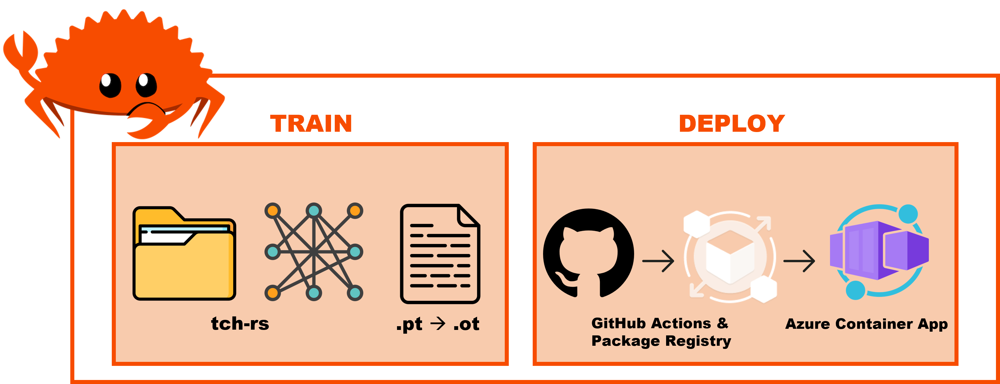

# Rusty Pipe [WiP]

**Project Repo:** [https://github.com/athletedecoded/rusty-pipe](https://github.com/athletedecoded/rusty-pipe)

E2E ML Pipeline -- from data to distroless deploy




## Train

**Download example dataset**

```
$ cd train
$ make dataset
```

**Train model**

```
$ cargo run hymenoptera_data
```

**Convert model for Deploy**

```
$ python3 -m venv ~/.venv
$ source ~/.venv/bin/activate
$ pip install -r requirements.txt
$ make models
```

## Deploy

**Test Locally**

```
$ cd ../deploy
$ make run
```

**Deploy to Azure Distroless Container**

1. Provision Container App `rusty-pipe` in Azure. Update Container App > Settings > Ingress > Port = 8080.

2. From Azure CLI, generate Service Principle Credentials. Capture output and add to Github Repo as `AZURE_CREDENTIALS` Actions Repository Secret.
```
az ad sp create-for-rbac --name "RustyPipeAccess" --role contributor --scopes /subscriptions/$AZURE_SUBSCRIPTION_ID --sdk-auth
```

3. Generate GitHub [PAT with write:packages access](https://github.com/settings/tokens/new?description=RustyPipe+Azure+access&scopes=write:packages). Capture output and add to Github Repo as `PAT` Actions Repository Secret.

4. Push then manually trigger from GitHub Actions > Trigger Auto Deploy from branch: deploy-distro

```
git checkout -b deploy-distro
git push origin deploy-distro
``` 

*Gotchas:*
* Rusty-Pipe Repo > Settings > Actions > General > Actions Permissions > Allow all actions
* Rusty-Pipe Repo > Settings > Actions > General > Workflow Permissions > Read & Write


## Useage & Endpoints

Local base URL https://localhost:8080

Example deployed URL https://rusty-pipe.livelyisland-7ce892fe.eastus.azurecontainerapps.io/

**GET /** -- Homepage

**POST /predict** -- Predict Image

```
curl -X POST -H "Content-Type: multipart/form-data" -F "image=@assets/ant.jpg" <base_url>/predict
```


## ToDos

**Train**
- [ ] Dataset: create tch dataloader that takes train_val split with class subdirectories
- [ ] Models: improve CNN, fix VGG, pass model as CLI param
- [ ] Dynamic class generation --> txt file --> deploy

**Deploy**
- [ ] Fix GHA deploy -- upload models to Azure Blob via SDK
- [ ] Switch from ot to onnx rt
- [ ] Load testing


## References

* [Rusty Deploy example](https://github.com/nogibjj/rusty-deploy)
* [tch-rs examples](https://github.com/LaurentMazare/tch-rs/tree/main/examples)