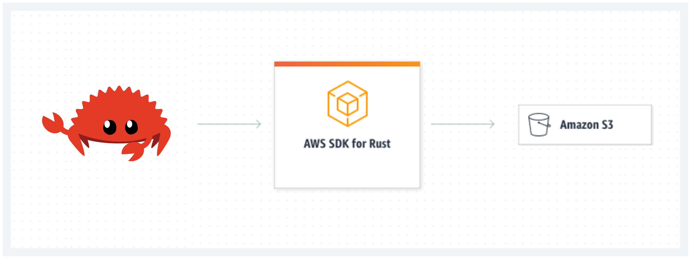

# Rust AWS S3 CLI

**Project Repo:** [https://github.com/athletedecoded/rust-s3-cli](https://github.com/athletedecoded/rust-s3-cli)

The current [AWS CLI](https://github.com/aws/aws-cli/tree/v2) is written in Python. For this project I have built a mini AWS S3 CLI using Rust which supports CRUD operations for buckets and objects.



## Project Goals/Outcomes

* Develop my first Rust project
* Use Github Codespaces and Copilot
* Integrate the 'AWS SDK for Rust' into a Rust project

## Setup

1. Create an [AWS IAM User Policy for S3](https://docs.aws.amazon.com/AmazonS3/latest/userguide/security-iam-awsmanpol.html)

2. Configure your [~/.aws/credentials file](https://docs.aws.amazon.com/cli/latest/userguide/cli-configure-files.html#cli-configure-files-where) with environment variables: `aws_access_key_id`, `aws_secret_access_key` and `region`

## Run

**List all S3 buckets**
```
$ cargo run list
```

**List all objects in a specified S3 bucket**
```
$ cargo run list --bucket <bucket_name>
# ex: cargo run list --bucket ids721
```

**Create new S3 bucket**
```
$ cargo run create --bucket <bucket_name>
# ex: cargo run create --bucket ids721
```

**Upload an object to an S3 bucket**

*NB: Will create bucket if DNE*
```
$ cargo run upload --bucket <bucket_name> --filepath <path_to_file>
# ex: cargo run upload --bucket ids721 --filepath ./test/test.png
```

**Delete an object from an S3 bucket**
```
$ cargo run delete --bucket <bucket_name> --key <object_key>
# ex: cargo run delete --bucket ids721 --key test.png
```

**Delete an empty S3 bucket**
```
$ cargo run delete --bucket <bucket_name>
# ex: cargo run delete --bucket ids721
```

**Get an object from an S3 bucket**
```
$ cargo run get --bucket <bucket_name> --key <object_key>
# ex: cargo run get --bucket ids721 --key test.jpg
```

## CI/CD

Github Actions configured in [.github/workflows/rust.yml](.github/workflows/rust.yml)

**Build Executable**
```
$ make release
```


## Progress Log

- [x] Create an [AWS IAM User Policy for S3](https://docs.aws.amazon.com/AmazonS3/latest/userguide/security-iam-awsmanpol.html)
- [x] Configure Github Codespaces with [AWS Toolkit Credential Profile](https://docs.aws.amazon.com/toolkit-for-vscode/latest/userguide/setup-credentials.html)
- [x] Initialise Rust project with [AWS SDK for Rust](https://github.com/awslabs/aws-sdk-rust)
- [x] Establish basic AWS client connection to list S3 buckets
- [x] Add clap command line parsing for arguments (bucket name, local file name)
- [x] Bucket fxns: list, create new, check if exists, delete if empty
- [x] Object fxns: list objects in bucket, upload to existing bucket, upload to new bucket, delete
- [x] CI/CD with Github Actions

## References

* [AWS SDK for Rust](https://github.com/awslabs/aws-sdk-rust)
* [AWS Toolkit Credential Profile](https://docs.aws.amazon.com/cli/latest/userguide/cli-configure-files.html#cli-configure-files-where)
* [AWS Credentials for VS Code](https://docs.aws.amazon.com/toolkit-for-vscode/latest/userguide/setup-credentials.html)
* [AWS IAM User Policy for S3](https://docs.aws.amazon.com/AmazonS3/latest/userguide/security-iam-awsmanpol.html)

